# FrontendSimpleMiniProjects
HTML CSS BOOTSTRAP JS (BASICS)

A collection of small front-end projects to practice and demonstrate various web development skills using HTML, CSS, and JavaScript.

## Features
* Responsive design examples
* Interactive UI components
* Basic animations and transitions

## Installation
```
git clone https://github.com/SamEag1e/Frontend_Mini_Projects.git
```
## Usage
Open the index.html file in your browser to view the projects.

## Contributing
Fork the repository.
Create a new branch (git checkout -b feature-branch).
Commit your changes (git commit -m 'Add new feature').
Push to the branch (git push origin feature-branch).
Open a pull request.

## License
This project is licensed under the MIT License.

## Images

### 1. Profile Card
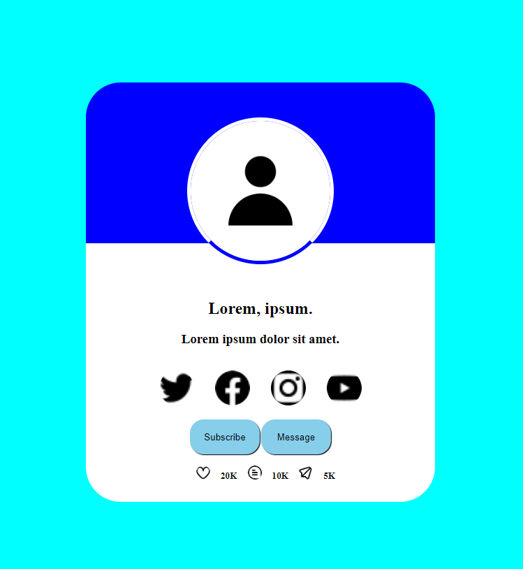

### 2. Profile Card-better
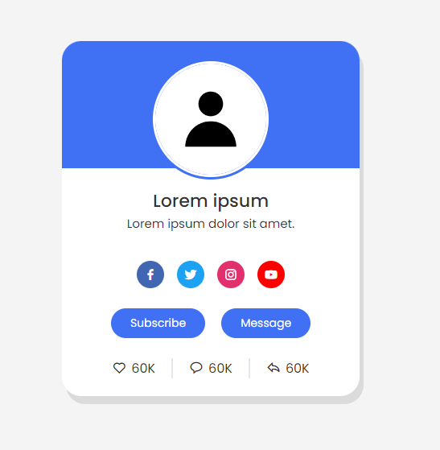

### 3. Flipping Card
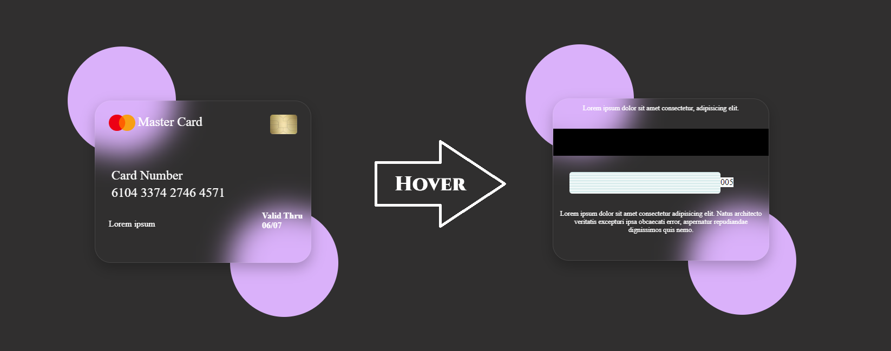

### 4. Slidebar
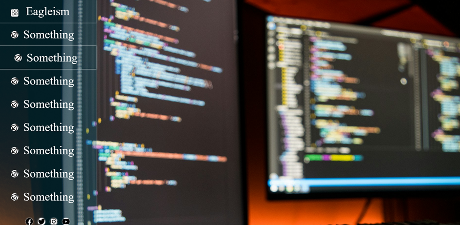

### 5. Slidebar better
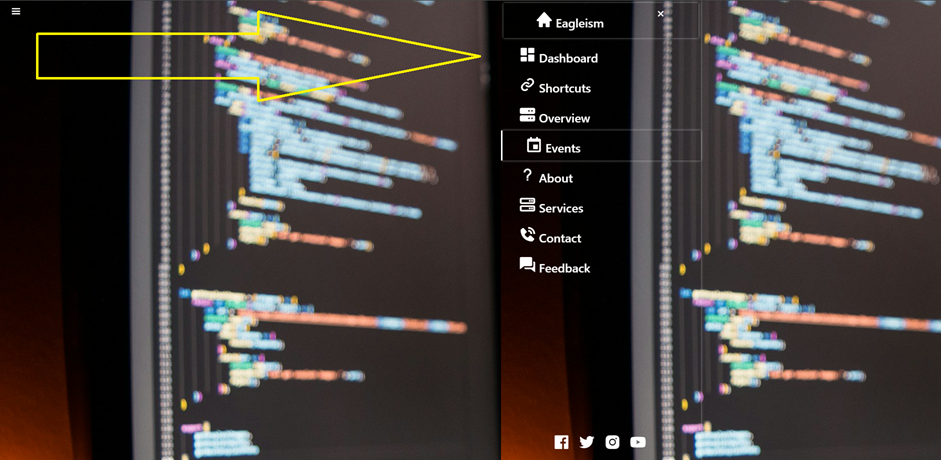

### 6. Login Form
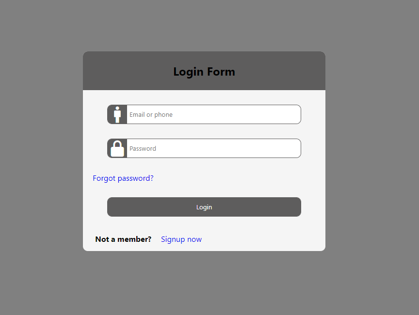

### 7. HomePage


### 8. HomePageBootStrap
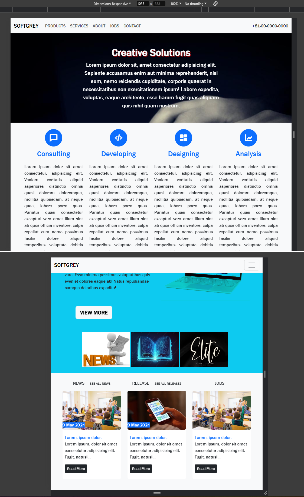

### 9. Contact Us
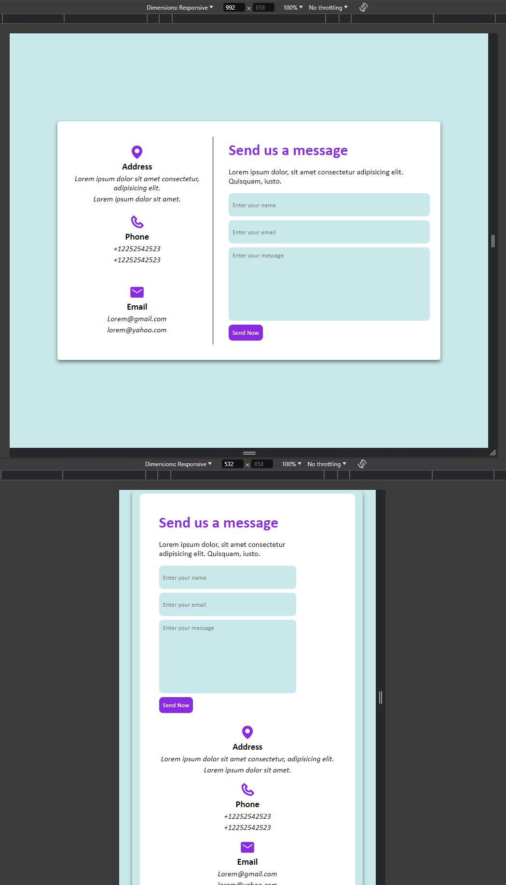

### 10. SearchBoxes&CustomCheckbox
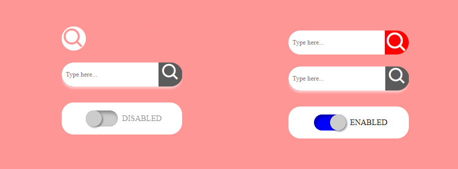

### 11. Tabs-Radio
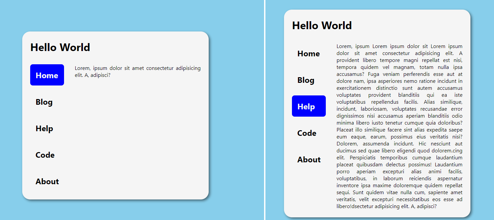

### 12. CardsHoverAnimation (NOT COMPLETE)

### Simple Animations
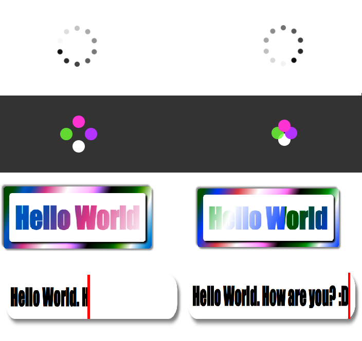
